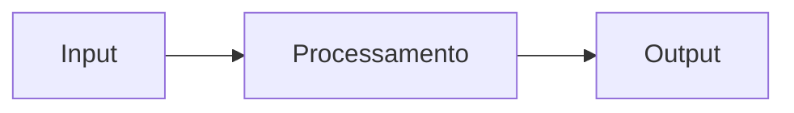

# project-template

Template base para novos projetos — CI, releases automáticas, changelog, commitlint, Husky e estrutura de documentação prontos para uso.

---

## O que está incluído

| Arquivo | Função |
|---------|--------|
| `.github/workflows/ci.yml` | Roda testes na branch e abre PR automático para `develop` se passar |
| `.github/workflows/promote.yml` | Abre PR automático de `develop` para `main` após cada merge |
| `.github/workflows/release.yml` | Versiona, gera changelog, cria release e notifica o portfolio-hub após merge em `main` |
| `package.json` | Scripts de changelog e versionamento |
| `.commitlintrc.json` | Enforça Conventional Commits em cada commit local |
| `.husky/commit-msg` | Hook que bloqueia commits fora do padrão |
| `.editorconfig` | Consistência de indentação e encoding entre editores |
| `.prettierrc.json` | Formatação de código padronizada |
| `.gitignore` | Ignora `node_modules`, `dist`, `.env` e afins |
| `docs/` | Estrutura base de documentação |
| `CHANGELOG.md` | Gerado e mantido automaticamente pelo CI |

---

## Como usar

### 1. Criar o repo a partir do template

No GitHub, clique em **Use this template → Create a new repository**.  
Dê um nome, escolha a visibilidade e confirme.

### 2. Configurar o secret no GitHub

No repo criado: **Settings → Secrets and variables → Actions → New repository secret**

| Nome | Valor |
|------|-------|
| `PORTFOLIO_TOKEN` | PAT com permissão `repo` no portfolio-hub |

> Gere o token em **GitHub → Settings → Developer settings → Personal access tokens (classic)**. Marque o escopo `repo`.  
> O portfolio-hub é localizado automaticamente como `{seu-usuario}/portfolio-hub` — nenhuma variável extra necessária.

### 3. Clonar e instalar dependências

```bash
git clone https://github.com/seu-usuario/seu-projeto
cd seu-projeto
npm install
```

O `npm install` ativa o Husky automaticamente via script `prepare`.

### 4. Registrar o projeto no portfolio-hub

Crie `projects/seu-projeto.json` no portfolio-hub:

```json
{
  "name": "seu-projeto",
  "display_name": "Seu Projeto",
  "description": "Descrição breve e impactante",
  "version": "0.1.0",
  "tags": ["Go", "Node", "Docker"],
  "repo_url": "https://github.com/seu-usuario/seu-projeto",
  "status": "active",
  "docs_updated_at": "",
  "changelog_updated_at": ""
}
```

**Status válidos:** `active` | `wip` | `archived`

A partir do primeiro merge em `main`, o portfolio-hub atualiza `version`, `docs_updated_at` e `changelog_updated_at` automaticamente.

---

## Fluxo completo

```
feature/foo  ou  bug/foo
       │
       │  push
       │  CI roda testes
       │  se passar → PR automático aberto para develop
       ▼
    develop
       │
       │  merge
       │  PR automático aberto para main
       ▼
     main  (produção)
       │
       │  merge
       │  bump de versão detectado pelos commits
       │  CHANGELOG.md gerado
       │  tag vX.Y.Z criada
       │  release publicada no GitHub
       │  portfolio-hub notificado
       ▼
  portfolio-hub atualizado
```

---

## Fazendo commits

Sempre trabalhe em branches com prefix `feature/` ou `bug/`:

```bash
git checkout -b feature/minha-funcionalidade
git checkout -b bug/corrige-timeout
```

Use o padrão **Conventional Commits**:

```bash
git commit -m "feat: adiciona endpoint de autenticação"
git commit -m "fix: corrige timeout na conexão com o banco"
git commit -m "docs: atualiza guia de uso"
```

Ou use o Commitizen para um assistente interativo:

```bash
npm run commit
```

### Tipos de commit

| Tipo | Aparece no changelog | Quando usar |
|------|---------------------|-------------|
| `feat` | sim — Features | Nova funcionalidade |
| `fix` | sim — Bug Fixes | Correção de bug |
| `perf` | sim — Performance | Melhoria de performance |
| `docs` | não | Só documentação |
| `refactor` | não | Refatoração sem mudança funcional |
| `test` | não | Testes |
| `chore` | não | Build, dependências, CI |

O escopo entre parênteses é opcional:

```bash
git commit -m "feat(auth): adiciona refresh token"
git commit -m "fix(api): retorno 404 incorreto na rota /users"
```

---

## Releases automáticas

A cada merge em `main` o CI determina o bump de versão analisando os commits desde a última tag:

| Commits contêm | Bump | Exemplo |
|----------------|------|---------|
| `tipo!:` ou `BREAKING CHANGE` | major | `1.2.0 → 2.0.0` |
| `feat:` | minor | `1.2.0 → 1.3.0` |
| qualquer outro | patch | `1.2.0 → 1.2.1` |

Depois do bump, o CI:

1. Atualiza a versão no `package.json`
2. Regenera o `CHANGELOG.md` completo
3. Commita, cria a tag `vX.Y.Z` e faz push
4. Publica a release no GitHub com o changelog como body
5. Envia `repository_dispatch` para o portfolio-hub

Nenhuma ação manual necessária.

---

## Editando o changelog manualmente

Para ajustar descrições ou remover ruído antes que uma release seja criada, edite e commite **somente** o `CHANGELOG.md`:

```bash
code CHANGELOG.md

git add CHANGELOG.md
git commit -m "docs: ajusta changelog"
git push
```

> Commits que alteram apenas `CHANGELOG.md` ou `docs/` não disparam o CI de release — sem risco de loop.

---

## Estrutura de documentação

```
docs/
├── README.md        ← visão geral e quickstart
├── architecture.md  ← decisões de design e diagrama
└── usage.md         ← guia de uso detalhado
```

Para diagramas, use blocos `mermaid` diretamente no Markdown:

````markdown

````

---

## Checklist pós-criação

- [ ] `npm install` rodado
- [ ] Secret `PORTFOLIO_TOKEN` configurado no GitHub
- [ ] `projects/seu-projeto.json` criado no portfolio-hub
- [ ] `docs/README.md` preenchido com visão geral do projeto
- [ ] `docs/architecture.md` preenchido com decisões de design
- [ ] Primeiro commit feito em uma branch `feature/` e mergeado até `main`

---

**Referências:** [Conventional Commits](https://www.conventionalcommits.org/) · [Semantic Versioning](https://semver.org/) · [Keep a Changelog](https://keepachangelog.com/)


testeaaaaaaaaaaaaaaaaaaaaaaaaaaaaaaaaaaaaaaaaaaaaaaaaaawdadadawd